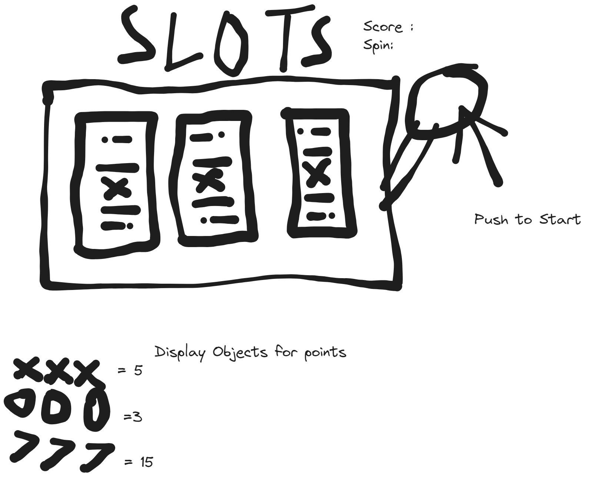

# Slots: Reels and Feelss

## Overview
"Reels and Feelss" is an engaging browser game that combines the thrill of slot games with a sleek, user-friendly interface. Built using HTML, CSS, and JavaScript, this game offers an immersive experience for players looking for fun and excitement.

## Technologies Used
- HTML
- CSS
- JavaScript

## Game Link
Play "Reels and Feelss" now: [Reels and Feelss](https://slots-beta.vercel.app)

Note: There is a win Animation and sound effect so if you win , you will know.
You must hit the reset button to continue playing after 10 spins.

## Screenshots/Wireframes

## Development Timeline
Here's a quick overview of our development process and milestones:

| Day         | Task                                       | Blockers                                    | Notes/Thoughts                          |
|-------------|--------------------------------------------|---------------------------------------------|-----------------------------------------|
| Friday      | Create proposal, HTML, JS, CSS files       | None                                        | Met Deadline                            |
| Saturday    | Scaffolding, Define Variables/Arrays, Init | None                                        | Met Deadline                            |
| Sunday      | Define Score, Spin Function, Win Conditions| Spin Function & Animation Issues            | Completed Wednesday                     |
| Monday      | Add Styling                                | Creative Paralysis                          | Completed Thursday                      |
| Tuesday     | Finalize MVP                               | None                                        | Finished Thursday Morning               |
| Wednesday   | Stretch Goals (Animations, Sound FX)       | None                                        | Added Reel Animations & Sound Effects   |
| Thursday    | Icebox Items (if applicable)               | None                                        |                                         |
| Friday      | Presentation Day                           | None                                        |                                         |

## Attributions
- Animations: [Animista](https://animista.net/)
- Sound Effects: [Soundsnap](https://www.soundsnap.com)

## MVPs (Minimum Viable Product)
- [x]  As a player, I to know if the spin was a win or a loss
- [x]  As a player, I want to know what spin number of 10 am i on 
- [x] As a player, I want to know what  my score at any current time
- [x] As a player who requires assistive technologies, I would like accessibility features so that I'm not     left out of enjoying the game.
- [x] As a player I would like to be able to restart the game after my 10 spins are over 
- [x]  As a player, I want the UI to be engaging and out of the way so that I enjoy the experience of playing the game

